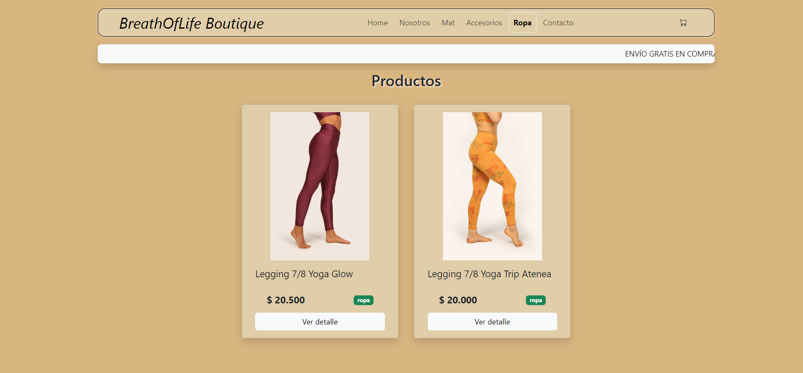

Final Project. Agustin Martinez. Course: React Js. Class N°: 47155

# BreathOfLife Boutique

BreathOfLife Boutique is an ecommerce that offers yoga's products. The project is created with the React library, using vite as a compilation tool. The styles were created with css module.

## Table of Contents

1. [Description](#description)
2. [Characteristics](#characteristics)
3. [Screenshots](#screenshot)
4. [Demo](#demo)
5. [Requirements](#requirements)
6. [Installation](#installation)
7. [Components](#components)
8. [License](#license)

## Description

This e-commerce offers Mat, accessories and clothes for sale. All of them are linked to the practice of Yoga. It has a main page with all the products, and the option to filter by categories in the navigation bar.

## Characteristics

- Catalog of Mat, accessories and clothes.
- Filtering products by categories.
- Shopping cart and payment process.
- Generate PDF for order confirmations
- Generation of orders and management of products in Firebase.

## Screenshot





## Demo

[video.webm](https://github.com/magustin28/e-commerce-yoga/assets/86117922/fdb1cb30-dff5-4cfd-9ced-0ee8bd285e2d)

## Requirements

Before you start working on this project, make sure you meet the following requirements:

- **Node.js y npm:** You must have Node.js installed on your system. You can download it from [nodejs.org](https://nodejs.org/).

- **Git:** It is recommended to have Git installed to manage version control of your project. You can download it from [git-scm.com](https://git-scm.com/).

## Installation

Follow these steps to install and run the app:

1. Clone this repository to your local machine using Git: `git clone` https://github.com/magustin28/e-commerce-yoga.git.
2. Navigate to the project directory: cd hera-project.
3. Install the project dependencies using npm:
   ```
   npm install
   npm i bootstrap
   npm i bootstrap-icons
   npm i prop-types
   npm i react-router-dom
   npm install firebase
   npm install @react-pdf/renderer --save
   ```
4. Start the application: `npm run dev`.
   The application should be available on localhost, in your web browser.

For correct operation, you must have the environment variables of the .env file set:

- apiKey: import.meta.env.VITE_FIRESTORE_API_KEY,
- authDomain: import.meta.env.VITE_FIRESTORE_AUTH_DOMAIN,
- projectId: import.meta.env.VITE_FIRESTORE_PROJECT_ID,
- storageBucket: import.meta.env.VITE_FIRESTORE_STORAGE_BUCKET,
- messagingSenderId: import.meta.env.VITE_FIRESTORE_MESSAGING_SENDER_ID,
- appId: import.meta.env.VITE_FIRESTORE_APP_ID,

## Components

- **Brand:** represents the brand identity of the application and serves as a clickable link to the homepage.
- **Cart:** manages and displays the items that a user has added to their shopping cart. It allows users to view and edit the contents of their cart, including adding or removing items and adjusting quantities.
- **CarWidgt:** displays the quantity of items in the cart.
- **Chechout:** handles the final steps of the shopping process, including a form for users to enter their name, email, phone, and payment method. It confirms the order before processing.
- **DownloadOrder:** allows users to download the purchase order in PDF format.
- **ItemCount:** manages the quantity of a product to be added to the cart.
- **ItemDetail:** presents detailed information about a specific product. It includes images, descriptions, pricing, and category.
- **ItemList:** displays a list of available products for sale and also allows filtering by product category.
- **Navbar:** represents the application's navigation bar, which contains links to product categories and pages of the application.
- **OrderProcessing:** renders the order once Firestore generates the order ID upon saving.

## License

This is a project for educational purposes, so it doesn’t have commercial functionality, no does it offer sensitive data. All products are fictitious, cannot be used for commercial purposes.
